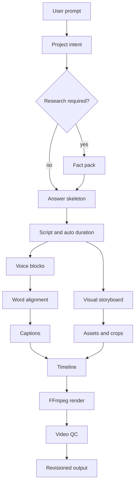

# ClipForge architecture

ClipForge stores a structured, revisioned project. An MP4 is an output of that state, never the source of truth.

## Current milestone

The repository implements the complete project core: intent classification, research planning, information structure, script blocks, duration estimation, storyboard, captions, timeline, revision history, dependency resolution, chat edits, and undo. The default `local` planner makes the product reviewable without secrets.

Provider-backed production is represented honestly in `ProjectState.integrations` and through adapter boundaries. The following adapters are the next production slice:

1. Brave/Wikipedia research and source normalization.
2. Pexels/Wikimedia search, license metadata, and OpenCLIP ranking.
3. Kokoro/OpenAI TTS and WhisperX alignment.
4. FFmpeg timeline compilation, ffprobe checks, and video QC.

## Revision rules

- `projects.original_prompt` is immutable.
- Every edit appends a `project_revisions` row.
- Each revision stores its parent and `projects.current_revision` is a pointer, so undo never destroys history even after a new edit branches from an earlier version.
- Stable scene IDs survive timing changes.
- Content hashes allow unchanged components to reuse cached artifacts.
- The dependency resolver invalidates only downstream components.
